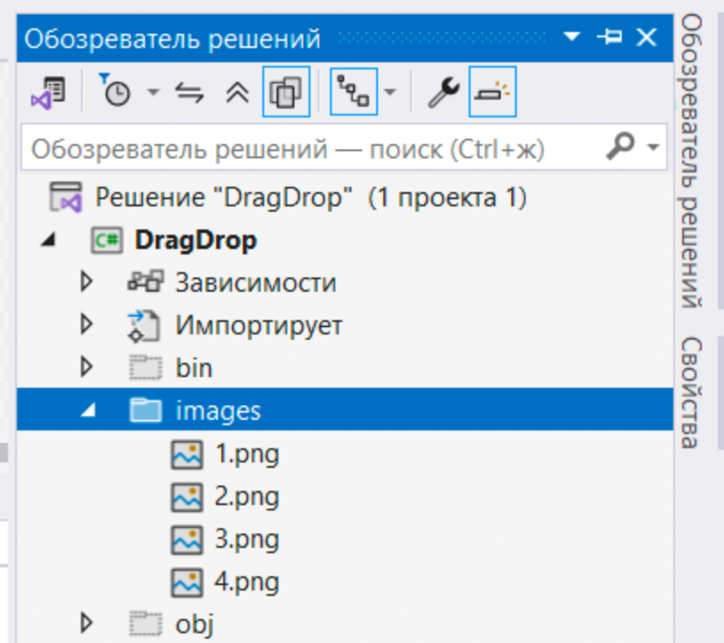
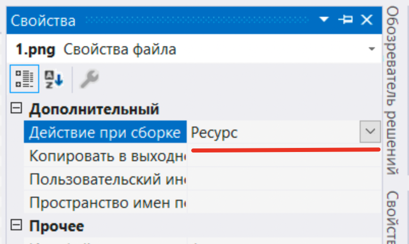
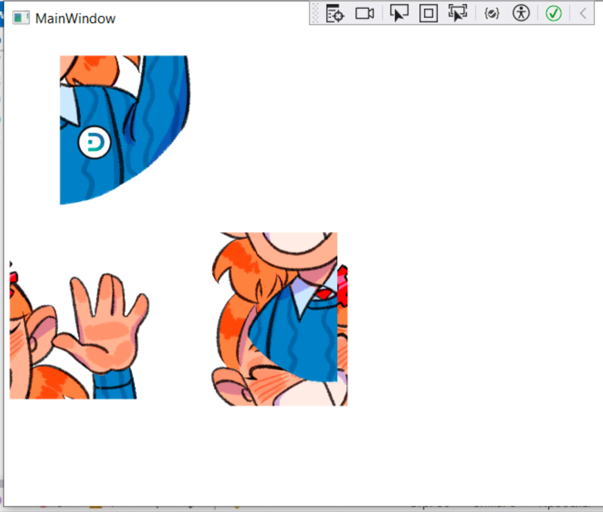
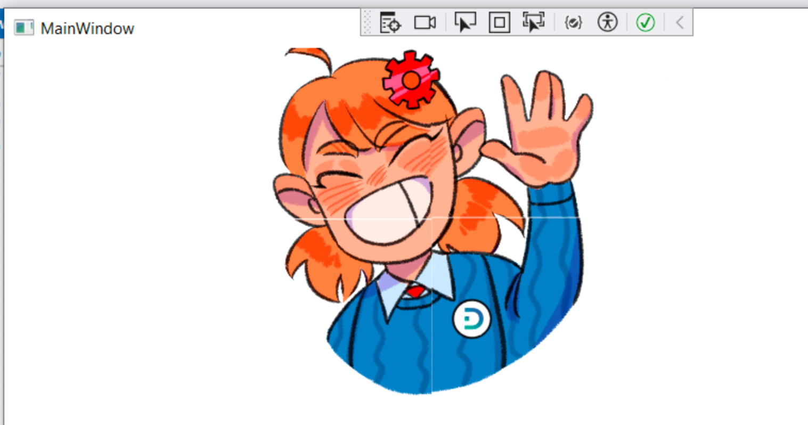

# Разбор модуля 4 предварительного задания демо-экзамена 2026 года

## Доработка структуры БД

>Для выполнения задания рекомендуется создать в базе данных таблицу "Пользователи". Если такая таблица уже существует, необходимо внести некоторые изменения для реализации дальнейшего функционала приложения.

Просто добавте таблицу с полями `login`, `password`, `role`, `enabled` и добавьте в нее пару записей с разными ролями (в этом модуле уже не оценивается ERD, поэтому делать таблицу ролей не обязательно)

## Авторизация по логиину/паролю

>Разработайте форму для авторизации зарегистрированных пользователей с ролями "Администратор" и "Пользователь". Форма должна содержать поля текстовые поля логин, пароль и кнопку "Войти". Поля "Логин" и "Пароль" должны быть обязательными для заполнения. При неверно введенных данных, пользователь должен получить сообщение об ошибке "Вы ввели неверный логин или пароль. Пожалуйста проверьте ещё раз введенные данные".
>
>После успешной авторизации пользователь должен получить сообщение "Вы успешно авторизовались".
>
>При аутентификации связка «логин/пароль» должна совпадать с одной из записей в таблице "Пользователи".

Тут все просто: заполняем логин/пароль и ищем в БД НЕ ЗАБЛОКИРОВАННОГО (`enabled = 1`) пользователя с таким логином и паролем

## Интерактивная капча

>На страницу авторизации добавьте интерактивную капчу, в которой пользователю необходимо собрать исходное изображение из фрагментов.
Метод сборки изображения может быть произвольным. После сборки изображения система проверяет правильность расположения фрагментов.
>
>Если пазл собран верно — пользователь проходит проверку и может авторизоваться.

Мы в рамках лекций с картинками особенно не работали - закроем этот пробел.

Что нам необходимо сделать:

- вывести в окне 4 картинки в случайные кооринаты
- реализовать перемещение картинок по окну
- проверить правильно ли собран паззл

### Вывод картинок

1. Создайте в окне именованный элемент __Canvas__ (у меня тестовое приложение, в котором он занимает все содержимое окна, вы вписывайте в форму авторизации)

    ```xml
    <Grid>
        <Canvas
            Name="DragArena"/>
    </Grid>
    ```

1. Создайте в проекте каталог __images__ и скопируйте в него части паззла

    

    Не забудьте каждое изображение включить в ресурсы

    

1. По идее картинки можно закинуть в канвас и руками, но я приведу программный способ:

    В конструкторе окна добавьте следующий код

    ```cs
    // это стандартное содержимое конструктора
    InitializeComponent();

    // дальше добавляемый код

    // создаем экземпляр генератора случайных чисел
    var random = new Random();

    for (int i = 1; i < 5; i++)
    {
        // создаем новую картинку
        Image myImage = new Image();

        // в качестве источника устанавливаем один из кусочков паззла
        myImage.Source = new BitmapImage(
            new Uri($"/images/{i}.png", UriKind.Relative)
        );

        // оригинальное изображение 700px, 
        // это, на мой взгляд, многовато - задаем 
        // альтернативный размер изображения
        myImage.Width = 200;

        // присваиваем обработчику клика левой кнопкой 
        // делегат (функцию обработчки)
        myImage.MouseLeftButtonDown += Image_MouseLeftButtonDown;

        // задаем левую/верхнюю точку для изображения 
        // случайным образом
        // в параметрах метода Next минимальное и максимальное
        // значение результата
        Canvas.SetLeft(myImage, random.Next(0, 200));
        Canvas.SetTop(myImage, random.Next(0, 200));

        // добавляем созданное и настроенное 
        // изображение на холст (Canvas)
        // (DragArena - название холста)
        DragArena.Children.Add(myImage);
    }
    ```

    И в класс окна дописываем поля, обработчики клика и движения мыши

    ```cs
    private Image? draggingImage;

    private void Image_MouseLeftButtonDown(
        object sender, 
        MouseButtonEventArgs e)
    {
        // на всякий случай проверяем, что кликнули по Image
        if (e.Source is Image image)
        {
            // запоминаем элемент, который будем двигать
            draggingImage = image;

            // вычисляем и запоминаем текущую координату
            relativeMousePos = e.GetPosition(draggingImage) - new Point();

            // задаем делегаты для отслеживания движения
            draggingImage.MouseMove += OnDragMove;
            draggingImage.LostMouseCapture += OnLostCapture;
            draggingImage.MouseUp += OnMouseUp;

            Mouse.Capture(draggingImage);
        }
    }

    // при движении мыши обновляем позицию активной картинки
    void OnDragMove(object sender, MouseEventArgs e)
    {
        UpdatePosition(e);
    }

    void UpdatePosition(MouseEventArgs e)
    {
        var point = e.GetPosition(DragArena);
        var newPos = point - relativeMousePos;
        Canvas.SetLeft(draggingImage, newPos.X);
        Canvas.SetTop(draggingImage, newPos.Y);
    }

    void OnMouseUp(object sender, MouseButtonEventArgs e)
    {
        FinishDrag(sender, e);
        Mouse.Capture(null);
    }

    void OnLostCapture(object sender, MouseEventArgs e)
    {
        FinishDrag(sender, e);
    }

    // при отпускании мыши отписываемся от делегатов
    void FinishDrag(object sender, MouseEventArgs e)
    {
        draggingImage.MouseMove -= OnDragMove;
        draggingImage.LostMouseCapture -= OnLostCapture;
        draggingImage.MouseUp -= OnMouseUp;
        UpdatePosition(e);
    }
    ```

Если все сделали правильно, то при зпуске приложения увидим что-то подобное:



Картинки перетаскиваютс мышкой и складываются в картинку



Код для проверки "собранности" паззла я не привожу, он примитивный - нужно сравнить координаты соседних кусочков паззла (для этого создать массив и записать созданные изображения в него), заложив допустимую дельту, чтобы не целиться с точностью до пикселя

## Блокировка аккаунта

>Если в течении 3-х раз подряд пазл собран не верно или не верно введен пароль, то учетная запись блокируется и при повторной авторизации должно появляться сообщение "Вы заблокированы. Обратитесь к администратору".

Меняем в БД поле `enabled` на `0`

## CRUD пользователей

>На рабочем столе пользователя с ролью "Администратор" предусмотрите функционал для добавления новых пользователей, изменения данных текущих пользователей (включая снятие блокировки). При добавлении нового пользователя следует проверять его наличие в базе данных.
В случае, если пользователь с указанным логином уже существует, должно выводиться соответствующее сообщение.

Тут обычный список пользователей с возможностью содания, удаления и редактироания