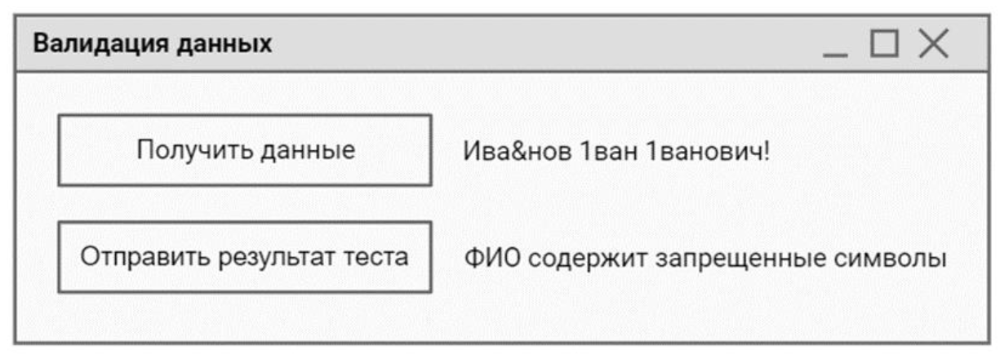

# Модуль 6. Интеграция программных модулей

>Для проверки данных от клиентов разработайте приложение, которое позволит провести валидацию на корректность данных. Результат проверки необходимо фиксировать в документе `ТестКейс.docx`.
>
>Сначала заполните в документе ТестКейс.docx столбец "Действие" и "Ожидаемый результат" используя предоставленный текстовый редактор. Добавьте закладки в столбец "Результат". Необходимо провести валидацию ФИО клиента на вхождение запрещенных символов. Проверьте два любых критерия.
>
>Для эмуляции отправки данных от клиента Вам необходимо запустить приложение `TransferSimulator.exe`. Методы эмулятора описаны в файле `api_info.pdf`.
>
>Макет формы представлен на рисунке.
>
>
>
При нажатии на кнопку "Получить данные" данные загружаются с эмулятора и отображаются на форме.
>
>После нажатия на кнопку "Отправить результат теста" происходит проверка данных по заполненному шаблону, и результат проверки
отображается на форме и в соответствующей строке таблицы в столбце "Результат".
>
>Важно: Разрабатывать API Вам не нужно. Используйте предоставленный API из приложения.

## Решение

Своими словами: Вы должны написать оконное приложение с двумя кнопками (скрин есть выше). При клике на кнопку "Получить данные" вы должны получить данные из АПИ (http сервер прилагается) и показать полученные данные в окне (справа от кнопки). При клике на кнопку "Отправить результаты теста" Вы должны вызвать **свой** метод проверки и результат проверки вывести справа от кнопки. Потом руками переписать полученные данные в приложенный файл `ТестКейс.docx`.

1. Получение данных из АПИ

    Для "разбора" json-строки (которую возвращает сервер) используется библиотека `Newtonsoft.json`, которую нужно установить из **NuGet** 

    ```cs
    // обработчик клика на кнопку
    private void GetFIOFromApi(object sender, RoutedEventArgs e)
    {
        HttpClient client = new HttpClient();

        // получение "тела" ответа от АПИ 
        var body = client.GetStringAsync("http://localhost:4444").Result;

        // разбор полученной JSON-строки в объект
        JObject jObject = JObject.Parse(body);

        // из объекта получаем значение по ключу
        FullNameTextButton.Text = JObject["value"].ToString();
    }
    ```

1. Проверка валидности ФИО

    Вариантов может быть несколько: либо создать массив запрещённых символов и перебрать их в цикле сравнив с ФИО из предыдущего пункта, либо написать регулярку (что на мой взгляд правильнее)

    Ниже пример проверки с выводом на консоль, Вам нужно выводить в текстовое поле вашего оконного приложения.

    ```cs
    Console.Write(jObject["value"].ToString());

    if (Regex.IsMatch(jObject["value"].ToString(), @"^[А-Яа-яЁё]+\s+[А-Яа-яЁё]+\s+[А-Яа-яЁё]+$"))
        Console.WriteLine(": Успешно");
    else     
        Console.WriteLine(": Не успешно");
    ```

## Пример заполнения `ТестКейс.docx`

Действие | Ожидаемый результат | Результат (Успешно/Не успешно)
---------|---------------------|-------------------------------
Колесников Евгений Иванович | Успешно | Успешно
Кропинов! Андрей Михайлович | Не успешно | Не успешно
Сергеев# Иван Сергеевич | Не успешно | Успешно

1. В колонке "Действие" пишете ФИО, полученное от АПИ
1. В Колонке "Ожидаемый результат" пишете то что должно получиться
1. В колонке "Результат" пишете результат проверки вашим методом

В идеале "Ожидаемый результат" и "Результат" должны совпадать
