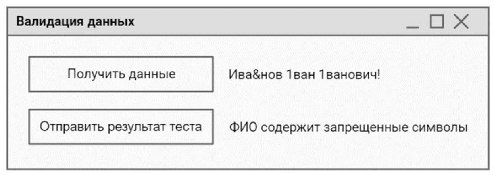

# Предварительное задание ДЭ 2026

Полный КОД (комплект оценочных документов) лежит [тут](https://bom.firpo.ru/file/public/117431/%D0%9A%D0%9E%D0%94%2009.02.07-5-2026%20%D0%A2%D0%BE%D0%BC%201.pdf)

>В КОД-е задания для разных уровней - ищите "ГИА ПУ" (ниже как раз его и разбираю)

[Приложения к заданию](https://bom.firpo.ru/file/public/105050/%D0%9F%D1%80%D0%B8%D0%BB_%D0%9E%D0%97_%D0%9A%D0%9E%D0%94%2009.02.07-5-2026.zip)

## Образец задания для ГИА ДЭ ПУ (инвариантная часть)

>В качестве образца выполнения можете использовать [прошлогодний разбор](https://kolei.ru/ekolesnikov/de2025) (позже сделаю аналогичный и для этого задания)

### Модуль 1. Проектирование ER - диаграммы

На основании документов, представленных заказчиком, необходимо спроектировать ER-диаграмму для информационной системы. Предприятие производит продукцию согласно установленным спецификациям и реализует готовую продукцию заказчикам. Каждая продукция имеет свою цену, зависящую от стоимости материалов.

Обязательна 3 нормальная форма с обеспечением ссылочной целостности. При разработке диаграммы обратите внимание на согласованную осмысленную схему именования, создайте необходимые первичные и внешние ключи. ER - диаграмма должна быть представлена в формате `.pdf` и содержать таблицы, связи между ними, атрибуты и ключи (типами данных на данном этапе можно пренебречь).

Необходимые приложения:

`Прил_1_ОЗ_КОД 09.02.07-5-2026-М1.rar`

>Я этот архив распаковал и включил в этот репозиторий в каталог [`DE09/2026/M1`](../DE09/2026/M1)

### Модуль 2. Разработка базы данных на основании ER-диаграммы

Создайте базу данных на основании разработанной ER-диаграммы, используя предпочтительную платформу, на сервере баз данных, который вам предоставлен. Создайте таблицы основных сущностей, атрибуты, отношения и необходимые ограничения. После создания базы данных требуется импортировать данные из файла "Заказчики.json".

Необходимые приложения:

`Прил_2_ОЗ_КОД 09.02.07-5-2026-М2.rar`

>В архиве один файл `Заказчики.json`, который уже есть в материалах к первому модулю

### Модуль 3. Создание запроса

Создайте запрос, позволяющий вычислить полную стоимость заказа покупателя с учетом следующей информации:

- количество продукции в заказе;
- стоимость всех материалов, использованных для производства данной продукции (учитывая норму расхода).

### Модуль 4. Разработка информационной системы

Для выполнения задания рекомендуется создать в базе данных таблицу "Пользователи". Если такая таблица уже существует, необходимо внести некоторые изменения для реализации дальнейшего функционала приложения.

Разработайте форму для авторизации зарегистрированных пользователей с ролями "Администратор" и "Пользователь". Форма должна содержать поля текстовые поля логин, пароль и кнопку "Войти". Поля "Логин" и "Пароль" должны быть обязательными для заполнения. При неверно введенных данных, пользователь должен получить сообщение об ошибке "Вы ввели неверный логин или пароль. Пожалуйста проверьте ещё раз введенные данные".

После успешной авторизации пользователь должен получить сообщение "Вы успешно авторизовались".

При аутентификации связка «логин/пароль» должна совпадать с одной из записей в таблице "Пользователи".

На страницу авторизации добавьте интерактивную капчу, в которой пользователю необходимо собрать исходное изображение из фрагментов.
Метод сборки изображения может быть произвольным. После сборки изображения система проверяет правильность расположения фрагментов.

Если пазл собран верно — пользователь проходит проверку и может авторизоваться.

Если в течении 3-х раз подряд пазл собран не верно или не верно введен пароль, то учетная запись блокируется и при повторной авторизации должно появляться сообщение "Вы заблокированы. Обратитесь к администратору".

На рабочем столе пользователя с ролью "Администратор" предусмотрите функционал для добавления новых пользователей, изменения данных текущих пользователей (включая снятие блокировки). При добавлении нового пользователя следует проверять его наличие в базе данных.
В случае, если пользователь с указанным логином уже существует, должно выводиться соответствующее сообщение.

Графический интерфейс необходимо разработать в соответствии с [требованиями к разработке](../DE09/2026/M4/Требования%20к%20разработке.pdf).

Необходимые приложения:

`Прил_3_ОЗ_КОД 09.02.07-5-2026-М4.rar`

>Я этот архив распаковал и включил в текущий репозиторий в каталог [`DE09/2026/M4`](../DE09/2026/M4)

### Модуль 5. Разработка проектной документации

Разработайте проектную документацию на разработанный функционал.
Включите описание функционального назначения, используемые методы с указанием параметров.

### Модуль 6. Интеграция программных модулей

Для проверки данных от клиентов разработайте приложение, которое позволит провести валидацию на корректность данных. Результат проверки необходимо фиксировать в документе `ТестКейс.docx`.

Сначала заполните в документе ТестКейс.docx столбец "Действие" и "Ожидаемый результат" используя предоставленный текстовый редактор. Добавьте закладки в столбец "Результат". Необходимо провести валидацию ФИО клиента на вхождение запрещенных символов. Проверьте два любых критерия.

Для эмуляции отправки данных от клиента Вам необходимо запустить приложение `TransferSimulator.exe`. Методы эмулятора описаны в файле `api_info.pdf`.

Макет формы представлен на рисунке.

При нажатии на кнопку "Получить данные" данные загружаются с эмулятора и отображаются на форме.

После нажатия на кнопку "Отправить результат теста" происходит проверка данных по заполненному шаблону, и результат проверки
отображается на форме и в соответствующей строке таблицы в столбце "Результат".

Важно: Разрабатывать API Вам не нужно. Используйте предоставленный API из приложения.

Необходимые приложения:

`Прил_4_ОЗ_КОД 09.02.07-5-2026-М6.rar`

>Я этот архив распаковал и включил в этот репозиторий в каталог [`DE09/2026/M6`](../DE09/2026/M6) (кроме приложения - позже напишу сервер на _Python_, т.к. _EXE/JAVA_ слишком "жирные")
