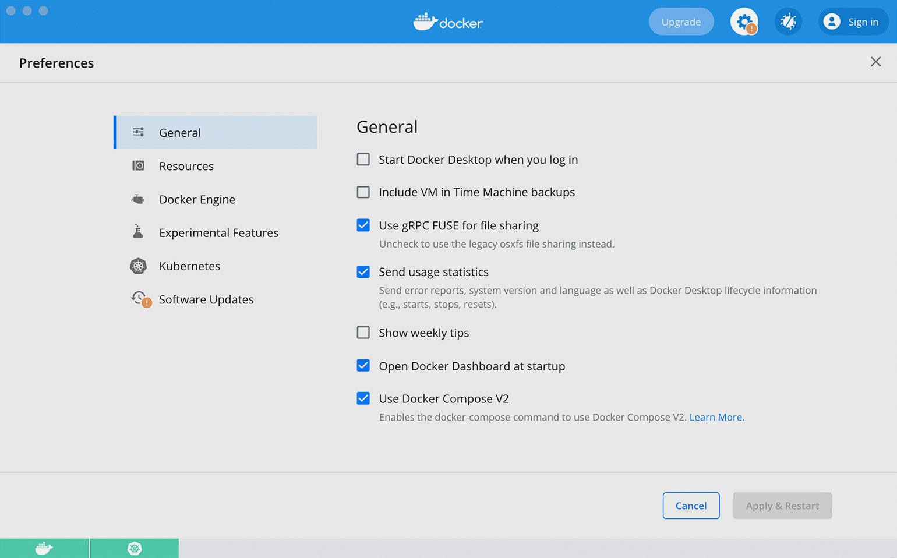
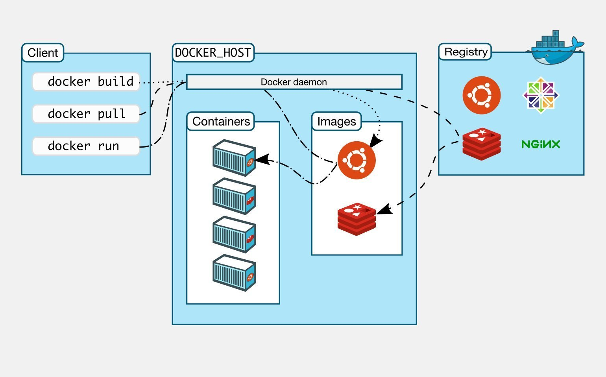
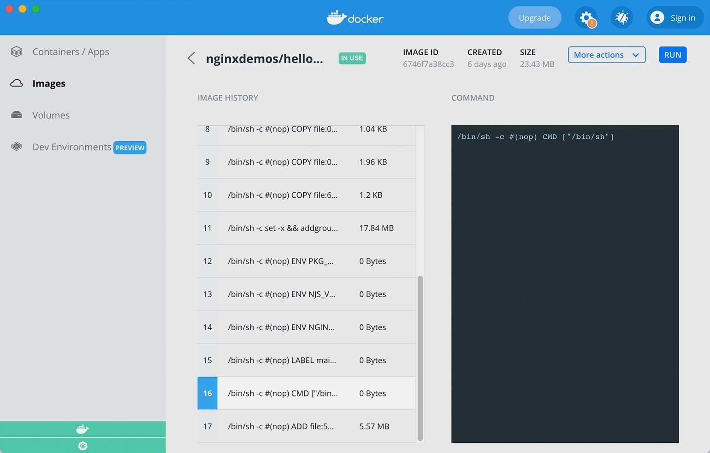
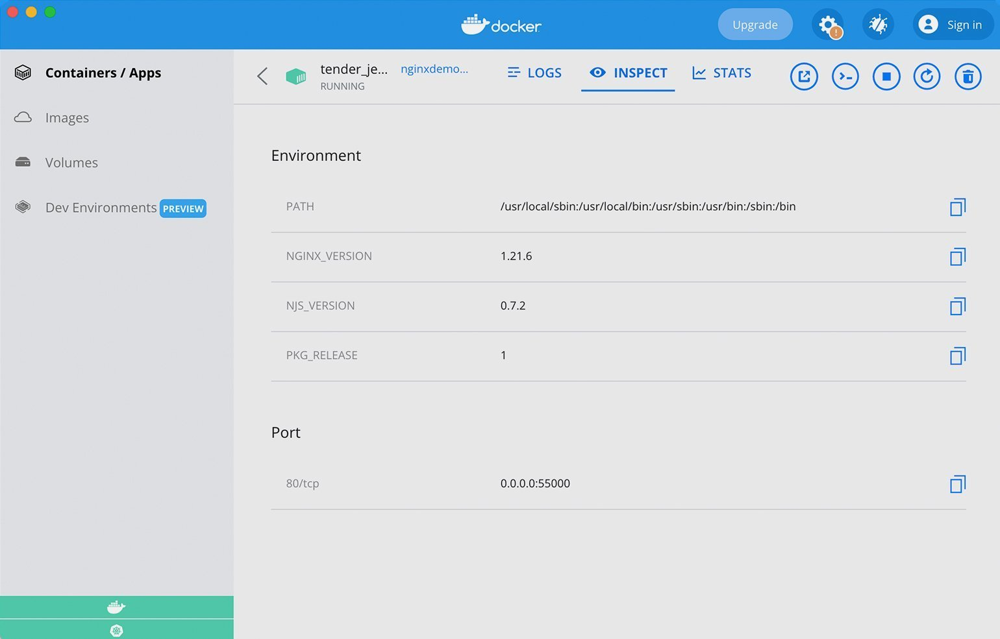

# Как работает Docker

>Содрано [отсюда](https://skillbox.ru/media/code/kak-rabotaet-docker-podrobnyy-gayd-ot-tekhlida/)

Контейнеризация — новая идеология в IT. В литературе приводят много аналогий, когда поставщики, то есть разработчики, упаковывают всё в один контейнер, как груз в порту. Это очень хорошая аналогия. Ведь цифровой контейнер точно так же перевозится и распаковывается в готовый продукт.

Основной инструмент контейнеризации — Docker, на его основе даже выстраивают внутреннюю сервисную инфраструктуру. Docker используют в сочетании с оркестраторами, такими как Kubernetes и OpenShift. Эти сервисы знаменуют переход от классических виртуалок к облачной инфраструктуре. С их помощью можно гибче, быстрее и динамичнее управлять ресурсами.

## Что такое Docker

Docker — это платформа, которая позволяет упаковать в контейнер приложение со всем окружением и зависимостями, а затем доставить и запустить его в целевой системе.

Приложение, упакованное в контейнер, изолируется от операционной системы и других приложений. Поэтому разработчики могут не задумываться, в каком окружении будет работать их приложение, а инженеры по эксплуатации — единообразно запускать приложения и меньше заботиться о системных зависимостях.

Популярность Docker продолжает расти, потому что его поддерживает большое сообщество. Платформа попала в мейнстрим на волне популярности [DevOps](https://skillbox.ru/media/code/chto_takoe_devops_i_zachem_on_nuzhen/?utm_source=media&utm_medium=link&utm_campaign=all_all_media_links_links_articles_all_all_skillbox), быстрых конвейеров доставки и автоматизации.

## Устройство и принцип работы Docker

Виртуализация в Docker реализуется на уровне ОС. Виртуальная среда запускается прямо из ядра основной операционной системы и использует её ресурсы.

В поставку Docker входят следующие компоненты:

* **Docker host** — это операционная система, на которую устанавливают Docker и на которой он работает.
* **Docker daemon** — служба, которая управляет Docker-объектами: сетями, хранилищами, образами и контейнерами.
* **Docker client** — консольный клиент, при помощи которого пользователи взаимодействуют с Docker daemon и отправляют ему команды, создают контейнеры и управляют ими.
* **Docker image** — это неизменяемый образ, из которого разворачивается контейнер.
* **Docker container** — развёрнутое и запущенное приложение.
* **Docker Registry** — репозиторий, в котором хранятся образы.
* **Dockerfile** — файл-инструкция для сборки образа.
* **Docker Compose** — инструмент для управления несколькими контейнерами. Он позволяет создавать контейнеры и задавать их конфигурацию.
* **Docker Desktop** — GUI-клиент, который распространяется по GPL. Бесплатная версия работает на Windows, macOS, а с недавних пор и на Linux. Это очень удобный клиент, который отображает все сущности Docker и позволяет запустить однонодовый Kubernetes для компьютера.

Docker изначально создавался под Linux. Поэтому на Windows и macOS запускают виртуальную машину с Linux, а поверх неё — Docker.

Работа поверх виртуалок повышает потребление ресурсов. Поэтому Docker на macOS и Windows работает медленнее и с рядом ограничений. Для разработки это приемлемо, но «в бою» так делать никто не будет. На всех популярных платформах в проде используют Linux.

## Чем виртуализация отличается от контейнеризации

Контейнеры и виртуальные машины — это разные способы виртуализации. Только виртуалка реализует её на уровне железа, а Docker — на уровне операционной системы.

Виртуальная машина функционирует как отдельный компьютер с собственным оборудованием и операционной системой. Распространённая практика — купить большой сервер и установить на него гипервизор, базу для виртуалок. Сервер «нарезается» на много виртуальных компьютеров, что избавляет нас от необходимости покупать их отдельно.

Виртуальные компьютеры вполне полноценны. На них можно установить операционную систему любого семейства и работать в ней, например, через графический интерфейс в многопользовательском режиме, устанавливая и запуская множество приложений и сервисов.

Если цель виртуалки — полностью воспроизвести устройство компьютера, то основная цель Docker — создать среду для одного приложения. Виртуальная среда контейнера запускается внутри операционной системы. Ей не нужно виртуализировать оборудование — она использует его через ОС. Поэтому контейнеры Docker потребляют меньше ресурсов, быстрее развёртываются, проще масштабируются и меньше весят.

>Выделять под приложение целую виртуалку, устанавливать и настраивать операционную систему, раздавать права доступа — слишком дорого. В большинстве случаев достаточно простого окружения, в котором запустится приложение. Для этого как раз подходит контейнер, который вмещает одно главное приложение.

Оба способа изолируют приложение от основной операционной системы, но если на виртуалку можно поставить любую ОС, то Docker ориентирован на ядро Linux. Недавно добавили возможность поднимать Windows, но я ещё не пробовал это делать.

Docker и виртуальные машины не очень хорошо сочетаются друг с другом. Да, иногда в продакшене сервер нарезают на виртуалки и в них запускают контейнеры. Но такая схема, с двойной виртуализацией, приводит к избыточному расходу ресурсов. Её часто критикуют, и, надо признаться, по делу. Если в компании всё же сложилась такая практика, вместо гипервизора можно поставить Kubernetes, который будет устанавливать приложения напрямую на железо.

>Обычно в крупных компаниях работают на виртуальных машинах, которые разворачиваются на железных машинах в ЦОДах. Инфраструктурные инженеры нарезают виртуальные компьютеры и выстраивают на них инфраструктуру. С помощью оркестраторов можно убрать эту лишнюю «прослойку».

Если же у вас много ресурсов, то можно поставить Docker на виртуалку, чтобы изолировать приложения друг от друга.

## Сущности Docker

Docker работает с несколькими сущностями.

**Docker image (образ)**. Это шаблон, по которому создают контейнеры. Его часто сравнивают со слоёным пирогом: мы накладываем слой файловой системы поверх слоя базового образа и получаем неизменяемый образ. В него можно установить приложение, конфигурации и зависимости. Другие образы могут наследоваться, поэтому если положить сверху слой файлов и закоммитить, то мы получим ещё один неизменяемый образ.

**Dockerfile**. Если Docker image — это пирог, то Dockerfile — рецепт его приготовления. В этом файле описаны основные инструкции для сборки образа: какой базовый образ взять, откуда и куда положить файлы и так далее.

**Контейнер** — это runtime-сущность на основе образа, приложение, которое мы развернули с помощью Docker. Можно провести такую аналогию: образ — это инсталлятор программы, а контейнер — уже запущенная программа.

При развёртывании контейнера поверх файловой системы создаётся ещё один изменяемый слой. Приложение внутри контейнера может записывать туда данные или редактировать их. После удаления контейнера данные стираются, но их можно сохранить с помощью volumes.

**Docker Registry**. Это репозиторий, в котором хранятся Docker-образы. Он может быть как локальным, так и публичным. Репозитории создают на платформах вроде Docker Hub и GitLab и размещают в них образы с описанием, разными версиями и тегами.

## Как Docker помогает на практике

Приведу несколько примеров использования Docker, которые хорошо иллюстрируют его преимущества.

### Разработка приложений с зависимостями

Обычно, чтобы установить какую-то библиотеку или базу данных, разработчику нужно прочитать инструкцию на сайте. Он её скачивает, устанавливает, настраивает и запускает. А когда нужно перейти на другую зависимость — удаляет. И так приходится возиться с каждой зависимостью.

Docker предоставляет альтернативный путь. Вендоры библиотек, фреймворков и баз данных практически каждый день публикуют на Docker Hub свой софт в виде Docker image. Образ можно скачать и развернуть через Docker, поработать с ним, запушить, а потом остановить или удалить, и в операционной системе не останется никаких следов.

Единый интерфейс управления исключает необходимость индивидуальных команд. Достаточно выучить команды Docker: как скачивать образы, запускать контейнеры, пробрасывать, останавливать и удалять порты. С Docker можно запустить сколько угодно одинаковых баз внутри одной операционки. Благодаря изоляции, если что-то пойдёт не так, ошибки не затронут операционную систему и ничего не сломают.

### Автоматизация тестирования

Чтобы запустить автотесты, требуются определённые зависимости, например базы данных, брокеры сообщений и тому подобное. Их необходимо предварительно установить и сконфигурировать на сервере сборки. В этом месте иногда возникают проблемы: если при настройке упустить какую-то деталь, то можно испортить данные или что-то поломать. Гораздо безопаснее автоматически развернуть зависимости в виде контейнера прямо на сервере. Это позволяет быстро прогнать тесты, а после — бесследно удалить контейнеры.

Даже если тесты «сломают» какие-то данные, они удалятся вместе с контейнером. Кроме того, сам сервер с Docker, на котором запускаются автотесты, станет универсальным. Ведь благодаря контейнеризации на нём можно будет запускать что угодно. А значит, вы сэкономите на железе и настройке системы.

### Публикация приложения

После тестирования проект упаковывают в образ и публикуют, передают клиентам или инфраструктурным инженерам.

Docker упрощает дальнейшее развёртывание приложения. SRE не нужно думать, какие зависимости установить, ведь всё уже упаковано в образ. Для них это чёрный ящик, который они обновляют единообразно и автоматически через одни и те же команды.

Среда для деплоя тоже становится универсальной, потому что всегда имеет дело только с контейнерами. Сегодня в ней развернули один контейнер, завтра — другой. При этом в контейнерах могут быть упакованы совершенно не похожие друг на друга приложения.

## Минусы Docker

Как известно, за удовольствие приходится платить. И Docker — не исключение.

**Высокое потребление ресурсов**. Docker создаёт дополнительную логическую прослойку и потребляет дополнительные ресурсы. Поэтому вы должны определить, что для вас более важно — ресурсы или удобства. Если ресурсов с запасом, можно смело ставить Docker — будете удобно обновлять и версионировать приложения, не боясь испортить операционную систему. Если же ресурсы в дефиците, то лучше использовать классическую схему установки приложений.

**Для больших приложений нужен оркестратор**. Docker подходит для запуска нескольких контейнеров. В стандартной поставке Docker Compose есть механизм, который позволяет управлять их запуском с помощью конфигурационного файла YAML. Но этот механизм простой, он не потянет приложение, включающее 50–100 сервисов. У Docker не хватит механизмов управления и распределения ресурсов, резервирования и отказоустойчивости, чтобы реализовывать разные схемы обновления контейнеров.

В больших приложениях с микросервисной архитектурой используют оркестраторы Kubernetes или OpenShift. Единицей управления в Kubernetes является контейнер Docker, но на голом Docker прод практически никто не держит. Когда-то в России были такие компании — они рассказывали о своём травмирующем опыте на конференциях :)

Kubernetes — это мощный слой абстракции над железом, альтернатива гипервизорам у виртуалок. Он позволяет настраивать политики безопасности, реализует различные схемы обновления и позволяет гибко управлять ресурсами.

**Проблемы с установкой на Windows и macOS**. Как я сказал ранее, Docker создавался под Linux. На других операционках он не поддерживает некоторые типы сетей. В большинстве случаев никто этого не заметит, но об этом ограничении нужно помнить. Также на некоторых устройствах возникает конфликт с Virtual Box при установке Docker на Windows.
