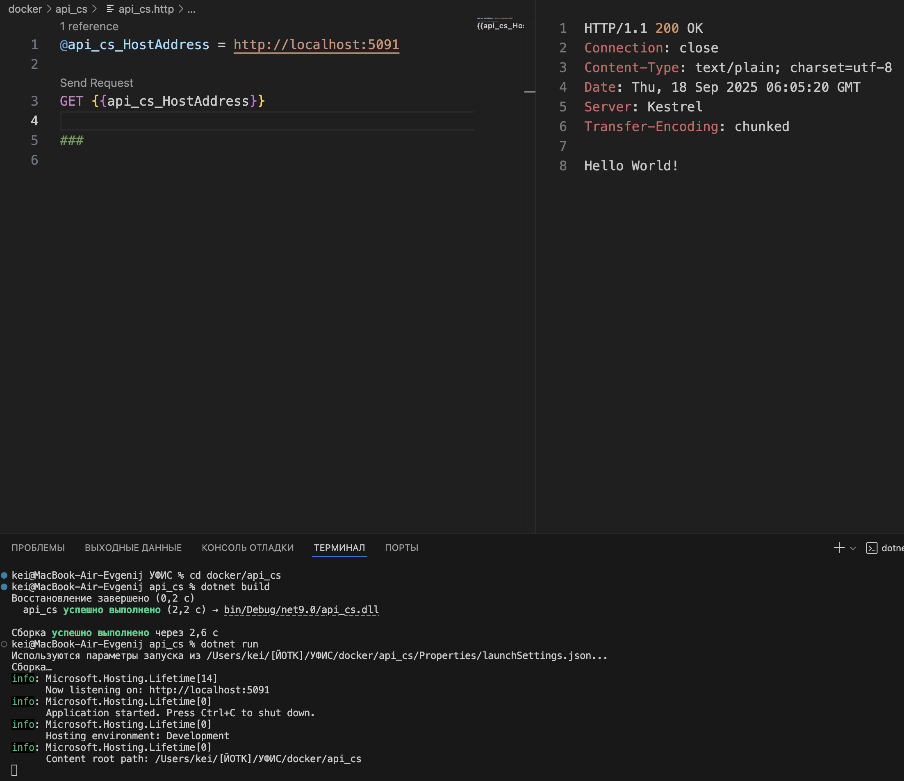
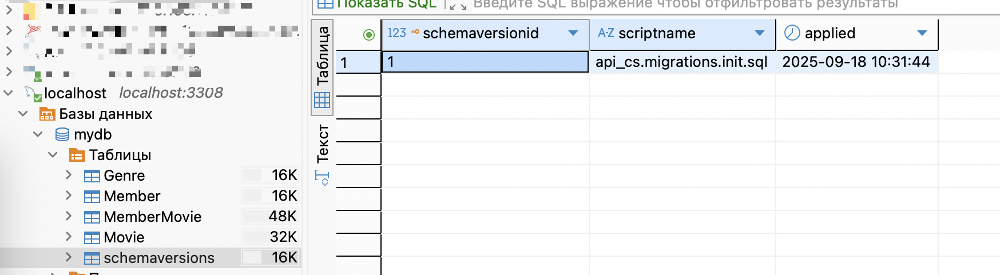

# Создание образа АПИ (C#). Оптимизация образа.

Для `Python` создание образа не сильно отличается от `JavaScript`, а вот для `C#` есть принциальное отличие. Дело в том, что `Python` и `JavaScript` интерпретируемые языки и им для работы нужен интерпретатор, а `C#` компилируемый и после сборки проекта `.NET` в образе уже не нужен. Поэтому для таких образов делают двухстадийную сборку, сначала в образе с установленным `.NET` компилируют исполняемый файл, а потом делают легковесный образ только с исполняемым файлом, полученным на первой стадии.

>Я буду создавать проект на **Macos**, поэтому использую VSC и консольные команды, но все то же самое можно сделать и в VS

## Создание минималистичного апи

Создание "рыбы" проекта:

```sh
dotnet new webapi -minimal -o api_cs
```

Параметр `-o api_cs` задает имя создаваемого проекта


Откройте файл `Program.cs` и поменяйте содержимое по умолчанию на следующее:

```cs
var builder = WebApplication.CreateBuilder(args);
var app = builder.Build();
app.MapGet("/", () => "Hello World!");
app.Run();
```

Перейдите в каталог с проектом и запустите команды 

```sh
dotnet build
dotnet run
```

На данном этапе проект должен собираться и запускаться без проблем, проверить работу можно выполнив http запрос (порт генерируется автоматически, у вас будет другой):



## Подключение к базе данных

Используем знакомые вам `MySqlConnector` и `Dapper`, установив их соответствующими командами:

```
dotnet add package MySqlConnector   
dotnet add package Dapper
```

### Создаем модель (класс для таблицы Genre)

Создайте каталог `model` и в нем класс **Genre** (консольная команда: `dotnet new class -n Genre`)

```cs
public class Genre
{
    public int id { get; set; }
    public required string title { get; set; }
}
```

### Создаем точку входа для получения списка жанров

```cs
string connectionString = "Server=127.0.0.1; Port=3308; User ID=root; Password=toor; Database=mydb";

app.MapGet("/genre", () =>
{
    using (MySqlConnection db = new MySqlConnection(connectionString))
    {
        return db.Query<Genre>(
            "SELECT * FROM Genre");
    }
});
```

На этом этапе тоже проблем быть не должно - у меня все запустилось

## Добавление миграций

Для **C#** существует много [систем для миграции](https://habr.com/ru/companies/crosstech/articles/453930/):

* **EntityFramework** - включает в себя и возможности миграции, но мы от него отказались и возрождать не будем
* **Fluent Migrator** - популярный, но требует создания дополнительных классов, а это лишние "проектные знания"
* **DBup** - небольшая обертка над чистыми SQL-скриптами, идеальный вариант для нас - его и будем использовать

[Делал по этому туториалу](https://medium.com/@niteshsinghal85/dbup-postgresql-dapper-in-asp-net-core-c3be6c580c54)

1. Созадем каталог `migrations`, где будем хранить скрипты для миграции
1. В настройках проекта (файл `*.csproj`) укажем, чтобы все SQL-файлы из этого каталога включались в проект

    ```xml
    <ItemGroup>
        <EmbeddedResource Include="migrations/*.sql" />
    </ItemGroup>
    ```
1. Создадим файл для миграции `migrations/init.sql`

    ```sql
    insert into Genre values
        (1, "Комедия"),
        (2, "Ужасы"),
        (3, "Триллер");   
    ```

1. Устанавливаем библиотеку `DBup`

    ```
    dotnet add package dbup-mysql
    ```

1. Дописываем в начало нашего `Program.cs` код для накатывания миграций

    ```cs
    // проверяет наличие возможности подключения к БД
    EnsureDatabase.For.MySqlDatabase(connectionString);

    // подгатавливает миграцию
    // куда и что будем накатывать
    var upgrader = DeployChanges.To
        .MySqlDatabase(connectionString)
        .WithScriptsEmbeddedInAssembly(Assembly.GetExecutingAssembly())
        .LogToConsole()
        .Build();

    // запуск миграции
    var result = upgrader.PerformUpgrade();

    // проверка результата миграции
    if (!result.Successful)
    {
        throw new Exception("Не смог сделать миграцию");
    }
    ```

    Если все сделали правильно, то в консоли увидите примерно такие логи

    ```
    2025-09-18 10:31:43 +03:00 [INF] Beginning database upgrade
    2025-09-18 10:31:43 +03:00 [INF] Checking whether journal table exists
    2025-09-18 10:31:43 +03:00 [INF] Journal table does not exist
    2025-09-18 10:31:43 +03:00 [INF] Executing Database Server script 'api_cs.migrations.init.sql'
    2025-09-18 10:31:43 +03:00 [INF] Checking whether journal table exists
    2025-09-18 10:31:43 +03:00 [INF] Creating the `schemaversions` table
    2025-09-18 10:31:44 +03:00 [INF] The `schemaversions` table has been created
    2025-09-18 10:31:44 +03:00 [INF] Upgrade successful
    ```

    А в базе добавится таблица `shemaversions`, в которой хранится какие миграции и когда применялись (чтобы повторно не накатить уже выполненную миграцию)

    

Наш проект готов к упаковке в контейнер

## Создание контейнера с многостадийной сборкой

Смысл многостадийной сборки в том, что для сборки (компиляции) проекта нужен **.NET SDK**, а для выполнения уже скомпилированного приложения достаточно так называемого **Runtime** (но можно пойти еще дальше и сделать Standalone приложение)

### SDK vs Runtime

* **SDK** - Используется для разработки приложений.

    Включает в себя все необходимые инструменты для написания компиляции и сборки приложений:

    * Компиляторы для C#, F#, VB.NET.
    * Инструменты командной строки - `dotnet build`, `dotnet run`.
    * Библиотеки и шаблоны проектов.

* **.NET Runtime** - Используется для выполнения уже готовых (скомпилированных) приложений.

    Включает только библиотеки и компоненты необходимые для работы приложения.

    * Среда выполнения Common Language Runtime CLR.
    * Базовые библиотеки .NET.


**.NET Runtime** выгоден, когда на компьютере запускается несколько программ на **.NET**, но принцип контейнеризации в том, что в каждом контейнере запущено только одно приложение. Компилятор позволяет создавать так называемые **Standalone** (независимые) приложения, для работы которых фреймворк уже не нужен 

Попробуем собрать все три варианта и сравнить размеры полученных образов (взято [отсюда](https://habr.com/ru/companies/lamoda/articles/807179/))

>Ссылки на официальные образы можно посмотреть на [сайте Microsoft](https://learn.microsoft.com/ru-ru/dotnet/architecture/microservices/net-core-net-framework-containers/official-net-docker-images)

### Вариант без оптимизации, просто сборка и запуск в образе SDK

Создадим файл `Dockerfile.sdk` (обратите внимание, имя файла с расширением - мы напишем несколько вариантов):

```Dockerfile
FROM mcr.microsoft.com/dotnet/sdk:9.0 AS build
                                      ^^^^^^^^
ARG BUILD_CONFIGURATION=Release
WORKDIR /src
COPY api_cs.csproj .
RUN dotnet restore api_cs.csproj
COPY . .
RUN dotnet build api_cs.csproj -c $BUILD_CONFIGURATION -o ./build
RUN dotnet publish api_cs.csproj -c $BUILD_CONFIGURATION -o ./publish /p:UseAppHost=false
CMD ["dotnet", "/src/publish/api_cs.dll"]
```

что нового:

* `FROM mcr.microsoft.com/dotnet/sdk:9.0 AS build` - при указании базового образа .NET мы указали для него алиас **build** - по этому алиасу мы потом сможем обращаться к содержимому этой стадии сборки
* `ARG BUILD_CONFIGURATION=Release` - **ARG**ument позволяет задать константы для часто используемых литералов
* `RUN dotnet restore api_cs.csproj` - команда `dotnet restore` скачивает зависимости проекта
* `RUN dotnet publish api_cs.csproj -c $BUILD_CONFIGURATION -o ./publish /p:UseAppHost=false` - Команда `dotnet publish` компилирует ваше приложение .NET и создает набор файлов (исполняемый файл, сборки, зависимости, файлы конфигурации) в выходной папке для его последующего развертывания на другом компьютере или в другой среде выполнения. Она готовит приложение к распространению и запуску вне среды разработки, собирая все необходимые для этого компоненты. 

Перед сборкой я вспомнил, что у нас параметры подключения к базе данных прибиты гвоздями - сделаем получение из переменной среды окружения:

```cs
string? connectionString = Environment.GetEnvironmentVariable("CONNECTION_STRING");

Console.WriteLine("connectionString (from ENV): {0}", connectionString);

if (connectionString == null)
    connectionString = "Server=127.0.0.1; Port=3308; User ID=root; Password=toor; Database=mydb;";
```

И соберем образ

```sh
docker build -f ./Dockerfile.sdk -t api_cs:sdk .
```

* `-f ./Dockerfile.sdk` - опция `-f` явно указывает имя докерфайла


Запускаем собранный образ:

```sh
docker run --name test_cs_sdk --network test-network -d -p 5000:8080 -e CONNECTION_STRING="Server=test_mysql; User ID=root; Password=toor; Database=mydb;" api_cs:sdk
```

Замечания:

1. В качестве внутреннего порта контейнера появился `8080` хотя в конфигах этого нигде нет - этот порт используется по-умолчанияю для режима `Release`
1. Наступил на грабли, предупреждаю: мы с вами в команде запуска сервера mysql не указали сеть (присоединились к ней позже), но если разворачивать эти контейнеры на другом компьютере или удалить и пересоздать контейнеры (мой случай), то окажется, что контейнер с MySQL запущен в собственной сети и апи его не найдет - добавьте в команду запуска контейнера с MySQL опцию `--network test-network`


У меня все заработало, проверить можно запросив список жанров на `5000` порту:

```rest
GET http://localhost:5000/genre
```

### Вариант с оптимизацией, добавление стадии запуска в образе Runtime

Сборка проекта здесь происходит как и в первом варианте с использованием образа SDK, поэтому скопируем предыдущий докерфайл и дадим название `Dockerfile.runtime`

Но в конец нового докерфайла допишем второй этап - копирование скомпилированных бинарников из первого образа в базовый образ `aspnet`:

```Dockerfile
FROM mcr.microsoft.com/dotnet/sdk:9.0 AS build
ARG BUILD_CONFIGURATION=Release
WORKDIR /src
COPY api_cs.csproj .
RUN dotnet restore api_cs.csproj
COPY . .
RUN dotnet build api_cs.csproj -c $BUILD_CONFIGURATION -o ./build
RUN dotnet publish api_cs.csproj -c $BUILD_CONFIGURATION -o ./publish /p:UseAppHost=false

FROM mcr.microsoft.com/dotnet/aspnet:9.0 AS runtime
WORKDIR /app
COPY --from=build /src/publish .

CMD ["dotnet", "/app/api_cs.dll"]
```

В принципе тут все очевидно, в команде COPY добавился параметр `--from`, который указывает, что исходные данные надо брать не в файловой системе, а в именованом образе

Собираем образ, присвоив ему соответствующий тег

```sh
docker build -f ./Dockerfile.runtime -t api_cs:runtime .
```

Запускаем собранный образ:

```sh
docker run --name test_cs_runtime --network test-network -d -p 5001:8080 -e CONNECTION_STRING="Server=test_mysql; User ID=root; Password=toor; Database=mydb;" api_cs:runtime
```

Все должно работать

```rest
GET http://localhost:5001/genre
```

### Вариант без .NET в образе, публикация standalone приложения

>У меня почему-то не скачивается образ чистого линукс (`FROM alpine`), поэтому собрал с образом aspnet (runtime)

```Dockerfile
FROM mcr.microsoft.com/dotnet/sdk:9.0 AS build
ARG BUILD_CONFIGURATION=Release
WORKDIR /src
COPY api_cs.csproj .
RUN dotnet restore api_cs.csproj
COPY . .
RUN dotnet build api_cs.csproj -c $BUILD_CONFIGURATION -o ./build
RUN dotnet publish api_cs.csproj -c $BUILD_CONFIGURATION -o ./publish -r linux-arm64 --self-contained true
                                                                      ^^^^^^^^^^^^^^^^^^^^^^^^^^^^^^^^^^^^
FROM mcr.microsoft.com/dotnet/aspnet:9.0 AS runtime
WORKDIR /app
COPY --from=build /src/publish .

RUN chmod 777 ./api_cs
CMD ./api_cs
```

В команде `dotnet publish` добавились параметры

* `-r linux-arm64` - целевая операционная система и архитектура исполняемого файла (OS в контейнере всегда linux, а вот архитектура зависит от процессора - для **Intel** нужно указывать `linux-x64`, в примере вариант для **Macos**)
* `--self-contained true` - собрать **standalone** приложение (включить все зависимости в приложение)
* `RUN chmod 777 ./api_cs` - исполняемому файлу даем права на выполнение и при запуске (`CMD ./api_cs`) уже не надо писать `dotnet`

```sh
docker build -f ./Dockerfile.standalone -t api_cs:standalone .
```

```sh
docker run --name test_cs_standalone --network test-network -d -p 5002:8080 -e CONNECTION_STRING="Server=test_mysql; User ID=root; Password=toor; Database=mydb;" api_cs:standalone
```

```rest
GET http://localhost:5002/genre
```

Посмотрим, как отличаются размеры разных вариантов сборки (команда `docker images`):

```
REPOSITORY             TAG          IMAGE ID       CREATED             SIZE
api_cs                 runtime      bddcceb05493   43 minutes ago      360MB
                       ^^^^^^^                                         ^^^^^
api_cs                 sdk          1a233bdb3e4e   About an hour ago   1.52GB
                       ^^^                                             ^^^^^^
api_cs                 standalone   4e44052e2b01   53 seconds ago      521MB
                       ^^^^^^^^^^                                      ^^^^^
test-api               latest       3b986ccd7bbf   2 weeks ago         254MB
test-mysql             latest       72f91044024b   2 weeks ago         800MB
```

Видно, что **runtime** занимает в четыре раза меньше места чем **sdk**. 
Использование **standalone** проверить не смог, образ **alpine** не скачивается. Удалось скачать образ **scratch**, образ на его основе занимает `160Мб`, но приложение в нем не запускается...