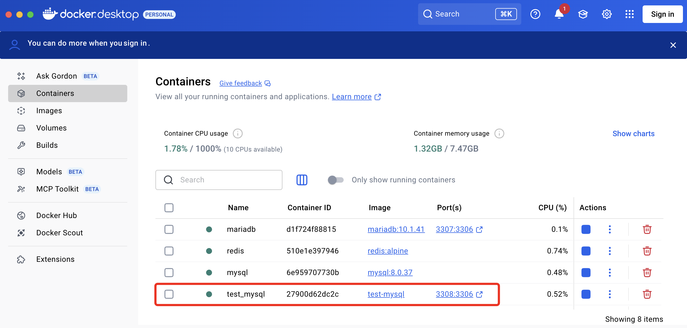

# Создание первого образа и запуск контейнера (база данных)

>У вас уже должен быть установлен Docker Desktop

Что мы хотим от базы данных?

1. Развернуть конкретную версию
1. Задать пароль для рута (в образе такие данные обычно не хранят, а задаются в переменных окружения при запуске контейнера)
1. Включить в образ дамп базы данных

Процесс будет выполняться в несколько этапов:

* создание `Dockerfile`, в котором мы опишем какой базовый образ взять и какой дамп использовать
* сборка образа
* запуск контейнера на основе созданного образа с указанием тома и переменных среды окружения

## Создание Dockerfile

```Dockerfile
# Используем официальный образ MySQL из Docker Hub конкретной версии
# Никакого сакрального смысла именно в этой версии нет, просто такая версия была в инфраструктурном листе площадки для демо-экзамена
FROM mysql:8.0.37

# Копируем ваш дамп (SQL-файл) в директорию, откуда MySQL будет его выполнять при первом запуске
# Замените `dump.sql` на имя вашего файла дампа
COPY dump.sql /docker-entrypoint-initdb.d/

# задаем переменные окружения, которые используются для настройки MySQL
# Не рекомендуется хранить пароль в образе, лучше использовать переменные окружения при запуске контейнера
# ENV MYSQL_ROOT_PASSWORD=your-root-password

# таймзона
ENV TZ="Europe/Moscow"

# по-умолчанию вход рутом разрешен только с localhost, этой переменной мы разрешаем вход откуда угодно (на проде так далать конечно нельзя, и вообще ходить рутом тоже)
ENV MYSQL_ROOT_HOST="%" 
```

Рассмотрим подробнее ключевые команды, которые мы использовали в `Dockerfile`.

* `FROM` — указывает исходный образ, на котором будет строиться контейнер. **Docker** загружает его из реестра (Docker Hub). Я тут указал конкретную версию, но можно использовать теги `latest` и `stable`
* `COPY` — копирование файлов из директории проекта в контейнер. Пример файла `dump.sql` есть в этом репозитории, вам, естественно, нужно положить дамп своей БД (вообще в интернете пишут, что таскать базу в образе моветон, но у нас тестовый проект и как минимум DDL скрипт прописать сюда можно, а данные потом накатим миграцией)
* `ENV` — устанавливает переменные среды, которые будут доступны внутри контейнера (не рекомендуется сюда писать логин/пароль).

>Файлы для образа (`Dockerfile` и `dump.sql`) лежат в каталоге [docker/mysql](../docker/mysql/) этого репозитория

## Сборка образа

>В текущем каталоге должен быть `Dockerfile` и дамп базы данных

```
docker build -t test-mysql .
```

* `docker build`: Консольная команда для сборки образа. 
* `-t test-mysql`: Присваивает вашему образу тег `test-mysql`. 
* `.`: Указывает, что `Dockerfile` находится в текущем каталоге. 

Пока в текущем каталоге никаких изменений вы не увидите - докер хранит все образы в отдельном каталоге

## Запуск образа с указанием тома (volume)

```sh
docker run --name test_mysql -d -p 3308:3306 -e MYSQL_ROOT_PASSWORD=toor -v ./db_volume:/var/lib/mysql test-mysql
```

* `docker run`: Консольная команда для запуска нового контейнера. 
* `--name test_mysql`: человекопонятное название контейнера, которое мотом можно использовать в командах `docker start` и `docker stop` (если имя не указать, то докер присвоит какое-то свое)
* `-d`: Запускает контейнер в фоновом режиме. 
* `-p 3308:3306`: Пробрасывает порт MySQL контейнера на ваш локальный хост (локальный слева, контейнер справа). Можно писать одинаковые, но у меня порты `3306` и `3307` уже заняты другими экземплярами. По-умолчанию порт открывается на внешнем сетевом интерфейсе, т.е. будет доступен во внешней сети. Если вам этого не нужно, то можно указать сеть явно, например только локально: `-p 127.0.0.1:3308:3306`
* `-e MYSQL_ROOT_PASSWORD=toor`: Устанавливает переменную окружения для пароля рута для MySQL.
* `-v ./db_volume:/var/lib/mysql`: создает каталог `db_volume` в текущем каталоге, который будет служить томом (volume) для файлов базы данных (напоминаю, что если не создать внешний том, то после остановки контейнера все данные потеряются)
* `test-mysql`: тег нашего образа (заданный на предыдущем шаге)

После выполнения этой команды можете либо запустить Docker Desktop и убедиться что контейнер запущен:



Либо в консоли выполнить команду `docker ps`, которая выведет список работающих контейнеров

Можем подключиться к контейнеру из менеджера баз данных и убедиться, что дамп накатился правильно


Уже существующий контейнер можно запустить и остановить командами `docker stop <имя контейнера>` и `docker start <имя контейнера>`

Итак, мы создали первый свой образ и запустили контейнер на его основе. Можно его использовать в локальной разработке, не устанавливая MySQL в основную операционную систему.

На следующих занятиях мы создадим образ для АПИ и объединим его в одну сеть с базой данных

## Полезные ссылки

* [Как создать образ в Docker](https://selectel.ru/blog/tutorials/how-to-create-docker-image/)

---

## Задание на дом

Создать свой образ для базы данных (можете поиграться с версиями) и запустить контейнер

В репозитории опубликовать Dockerfile, дамп базы данных, команды для сборки образа и запуска контейнера и скриншот Docker Desktop с запущенным контейнером.